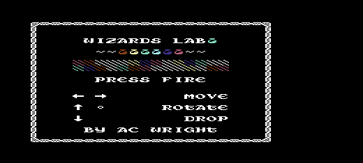
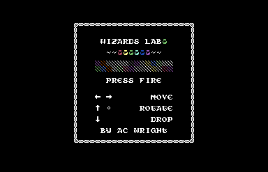
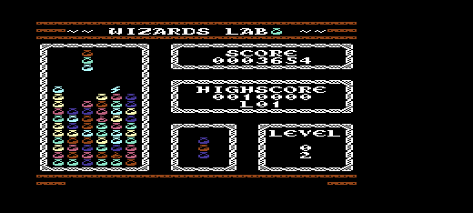
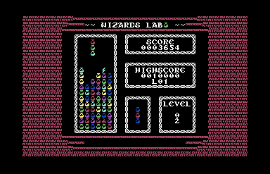

WIZARDS LAB
===========

A falling-block match-three game for the [AC6502](https://github.com/acwright/6502-ACE),
the Commodore VIC-20 and the Commodore 64 — one game, three 16 KB cartridges,
written in 6502 assembly.

Potions rain down from the shelves of a wizard's laboratory in vials of six
colours. Line up three or more of a colour — horizontally, vertically or
diagonally — and they react and vanish, dropping whatever sat above them into
new arrangements. Among the potions fall **arcane reagents**: fireballs, bolts,
bombs, stars and prisms. Placed well, they set each other off, and a single
piece can unravel half the board.

| VIC-20 | Commodore 64 |
|---|---|
|  |  |
|  |  |

*The title screen, and a game 32 pieces in.*

> **Status: in development.** The three cartridges build, boot and play.
> **The artwork is finished** — all 256 tiles and both screens are drawn — and
> the game is complete end to end: title, play, pause, game over and back to
> the title, with the reagents, the scoring, the animation and the sound all
> in. **Both Commodores have run on real hardware** — a gold-label NTSC VIC-20
> with its original MOS 6560, loaded off an sd2iec as `WizardsLab-VIC20.prg`,
> and a C64 on a **C64 Ultimate** with the `.crt` picked off the SD card.
> **PAL is untested on both**, for want of a PAL machine rather than for want
> of trying — the region tables run correctly under VICE in PAL mode, and that
> is as far as it goes here. What is left is the AC6502 on real hardware. See
> [PLAN.md](PLAN.md) for what is done and what is next.

---

## Download and play

**[Get the cartridge images from the latest release.](https://github.com/acwright/WIZARDSLAB/releases/latest)**
No toolchain needed — they are ready to run. **One file per machine**, in
`run/`:

| You have | Download | Then |
|---|---|---|
| An AC6502 | `WizardsLab-AC6502.crt` | `6502 run --cart WizardsLab-AC6502.crt` |
| A Commodore 64 | `WizardsLab-C64.crt` | `x64sc -cartcrt WizardsLab-C64.crt` |
| A VIC-20 | `WizardsLab-VIC20.crt` | `xvic -cartcrt WizardsLab-VIC20.crt` |

Or drag the `.crt` onto a running VICE window. On a **C64 Ultimate**, an
**Ultimate II+** or a VIC-20 **Final Expansion 3**, copy `run/` to the SD card
and pick the `.crt` from the file browser.

**On a VIC-20 with a disk drive, take `WizardsLab-VIC20.prg` instead.** An
sd2iec, the SD side of a **Penultimate Cartridge**, or a real 1541 is a disk
drive, and a `.crt` means nothing to one: a cartridge has to be ROM in the
address space at reset, which is when the VIC-20 looks for it, and a drive
cannot put it there. The `.prg` is the same 16 KB carried as a program that
copies itself to `$6000` and `$A000` and jumps to the cartridge's own cold-start
vector. **Set the memory to 32K or 35K before running it** — the two blocks have
to have somewhere to land, and that is the one thing that usually goes wrong.

The two Commodore files are proper VICE `.crt` containers, which is what makes
that work: the load address is inside the file, so nothing has to be told where
the ROM belongs. **The VIC-20 is one file too** — its 16 KB is two 8 KB blocks
at different addresses, BLK5 at `$A000` for the code and BLK3 at `$6000` for
the artwork, and the container holds both. The AC6502's image is raw by that
platform's convention; its emulator takes it as it is.

The download's other half is `eprom/` — the same game as raw ROM images, named
for their size and load address, for anyone burning a real cartridge. See
[Burning to a cartridge](#burning-to-a-cartridge).

> The cartridges this repository *builds* are the raw images, under each
> platform directory, and they keep the `.crt` extension the sibling projects
> use. `make dist` is what turns them into the loadable containers above — see
> [The download](#the-download).

---

## How it plays

Pieces are vertical stacks of three vials. Steer them into the well, rotate to
reorder the three colours, and match.

| | Joystick | Keyboard |
|---|---|---|
| Rotate | Up | `W` · Cursor Up |
| Soft drop | Down | `S` · Cursor Down |
| Move | Left / Right | `A` / `D` · Cursor Left / Right |
| Rotate back | Fire | `Q` · `SPACE` |
| Pause | — | `P` |
| Start | Fire | `SPACE` · `RETURN` |

Joysticks are Atari 2600 compatible — port 2 on the C64.

### The one rule worth knowing

**Tiles match on colour. The glyph on a tile decides what happens when it
clears.** A red potion, a red fireball and a red star are all "red" — so every
reagent is aimed exactly like the potion it resembles, and you choose when to
set it off.

| | | |
|---|---|---|
| 🔥 **Fireball** | Destroys every tile of its own colour, board wide | for scattered colour junk |
| ⚡ **Bolt** | Clears its whole row and column, up to 21 cells | for junk buried deep in a column |
| 💣 **Bomb** | Clears the 3 × 3 around it | for a local tangle |
| ⭐ **Star** | Doubles the whole cascade's score, up to ×8 | for holding a chain back one more piece |
| 🔮 **Prism** | Wildcard — matches any colour | for a board that has run out of options |

A reagent caught in another reagent's blast **goes off too**. That is where the
game lives.

The full rules, scoring tables and level speeds are in **[SPEC.md](SPEC.md)**.

---

## Building

Needs the [cc65](https://cc65.github.io/) toolchain:

```bash
brew install cc65        # or see cc65.github.io for other platforms
```

Then:

```bash
make              # Build all three cartridges
make run-C64      # Launch one in an emulator
make smoke        # Boot all three headless and check they come up
make playtest     # Play it with a script and check what the game did
make crosscheck   # Play the same game on all three and compare the wells
make audiocheck   # Read what the Commodores' sound chips are actually told
make dist         # Build the download: .crt containers, ROMs, README, zip
make artwork      # Re-import the art after drawing in TMS9918-EDITOR
make screenshots  # Retake the four screenshots at the top of this file
make clean
```

`make DEBUG=1` skips the title screen and starts playing, which is how a
headless machine gets past a screen it has no input to answer.

Each platform directory has its own Makefile with the same targets, so
`cd C64 && make run` works too. `make view` hexdumps a cartridge image.

### What gets built

| Platform | File | Size |
|---|---|---|
| AC6502 | `AC6502/WizardsLab.crt` | 32 KB† |
| VIC-20 | `VIC20/WizardsLab-blk5.crt` and `-blk3.crt` | 8 KB each |
| C64 | `C64/WizardsLab.crt` | 16 KB |

† 16 KB of cartridge inside a 32 KB file spanning `$8000-$FFFF`, so it burns
straight to a 28C256. The low half is padding the machine never reads.

The VIC-20's 16 KB is two 8 KB blocks at different addresses, so it is two
files: BLK5 (`$A000`) holds the autostart header and the code, BLK3 (`$6000`)
holds the tileset and screen images.

> **These `.crt` files are raw ROM images, not VICE `.crt` container files.**
> The extension follows the convention in the sibling repositories. `make dist`
> is what turns them into the loadable containers below.

### The download

`make dist` builds what the release and the itch.io page both serve, into
`dist/`. It is the raw images above, packaged twice, because **a cartridge
image and an EPROM image are not the same file**:

```
run/     WizardsLab-C64.crt              .crt container, 16 KB at $8000
         WizardsLab-VIC20.crt            .crt container, BOTH blocks
         WizardsLab-VIC20.prg            disk conversion, for sd2iec etc.
         WizardsLab-AC6502.crt           raw, the AC6502's own convention
eprom/   WizardsLab-C64-16k-8000.bin
         WizardsLab-VIC20-blk5-8k-a000.bin
         WizardsLab-VIC20-blk3-8k-6000.bin
         WizardsLab-AC6502-32k-8000.bin
```

`WizardsLab-VIC20.prg` is the odd one out: not a container at all, but the
cartridge turned into a program, for the drives that cannot take a container.
It is a `10 SYS 4624` BASIC line, a sixty-one byte copier, and the two ROM
blocks as payload — the same shape as every cart-to-disk conversion on an
sd2iec card. `tools/prg.py` builds it, and proves it by booting the conversion
and the real cartridge side by side and requiring the same title screen; a
block sent to the wrong address moves that from 1% of pixels to 95%.

A raw image is the right thing to burn and the wrong thing to hand somebody
with a flash cart, because nothing in it says where in the address map it
belongs — VICE will not take one by drag and drop and an Ultimate II+ will not
list it. A `.crt` carries the load address inside it, and the VIC-20's carries
both of its blocks, so every machine becomes one file to load.

The containers are built with VICE's own `cartconv`, except for the one thing
`cartconv` cannot say. A VIC-20 `.crt` holds a CHIP packet per block, each with
its own load address — exactly this cartridge's shape — but `cartconv`'s `-l`
is one global setting rather than one per input: pass two `-i` and two `-l` and
**both** packets come out at whichever address was named last, and it reports
success. So each block is converted alone and the packets joined, and the
result is read back and checked packet by packet.

**Then every container is booted.** `make dist` attaches each one to a headless
emulator and requires it to come up before the zip is written. A cartridge
image that does not load is the failure the whole target exists to prevent, and
it is not one you can see by looking at the file.

---

## Running in an emulator

These are the raw build outputs, so VICE has to be told where each one goes.
For the containers that carry their own load address, see
[Download and play](#download-and-play).

```bash
# AC6502 — https://github.com/acwright/6502-EMULATOR
6502 run --cart AC6502/WizardsLab.crt

# VIC-20 — VICE
xvic -cartA VIC20/WizardsLab-blk5.crt -cart6 VIC20/WizardsLab-blk3.crt

# C64 — VICE
x64sc -cart16 C64/WizardsLab.crt
```

`make smoke` runs all three headless instead, fails if a cartridge hangs
rather than reaching its main loop, and leaves a screenshot beside each
Commodore image. It is the fastest way to tell whether a change to the
platform layer broke a boot.

`make screenshots` retakes the four pictures at the top of this file — those
PNGs are throwaway and gitignored, these are committed. **The play shots are a
real game, played.** Left alone the game drops every piece down the spawn
column, so the tool drives it the way a player does: VICE's remote monitor
stops the machine on `HalReadInput` every frame and hands the game a joystick
mask on the way out, so the auto-repeat, the rotate edge and the lock delay all
see a stick being held. Nothing writes the board or the score. Both machines
are dealt the same game — the frame counter the seed is taken from is set
before FIRE — and play it identically, which the run checks by reading both
wells back off the two PNGs and comparing them cell for cell. The title shots
are stepped forward until the blinking prompt is on screen rather than caught
on its dark half. There are no AC6502 shots because its emulator writes no PNG.

`make playtest` goes further: it boots the AC6502 build paused and advances it
a game frame at a time with the joystick held wherever the test wants it,
reading the piece's column, row and contents straight out of RAM after each
frame. So the auto-repeat delay, the lock delay, soft-drop speed, the walls and
the floor are all assertions about numbers rather than about pixels. It also
writes boards into RAM to order, which is how the match scanner, the clears and
the falling pile are checked — including one board read back out of the video
chip to prove that what the game believes is also what is on the screen.

`make crosscheck` is the cross-platform half of it: one headless game on each
of the three machines, played to game over, with the wells compared cell by
cell. The two Commodores are read off their screenshots — and the well *is* the
board, since the board byte is the tile index.

`make audiocheck` does the same for the sound. VICE's `dump` sound device
writes one line per sound-chip register write, so a headless game leaves a
cycle-stamped transcript of everything the game told the SID or the VIC-I —
and every note in it is compared against the effect tables, register for
register and frame for frame. Nothing listens to anything.

---

## Burning to a cartridge

| Platform | Device | Notes |
|---|---|---|
| AC6502 | 28C256 EEPROM or 27C256 EPROM | `cd AC6502 && make eeprom` writes it with [minipro](https://gitlab.com/DavidGriffith/minipro) |
| VIC-20 | Two 27C64s, or one 27C128 | One ROM per block: BLK5 at `$A000`, BLK3 at `$6000`. Most VIC-20 cartridge boards socket the two separately |
| C64 | 27C128 (16 KB) | Pull **EXROM and GAME both low** so ROML `$8000` and ROMH `$A000` map together |

The AC6502 target is the only one wired up in the Makefiles, because it is the
only one whose programmer command is unambiguous. For the Commodores, feed the
raw image to whatever your programmer expects — that is what `eprom/` in the
[download](#the-download) is, named for size and load address, and it is the
build output under each platform directory unchanged.

---

## Layout

```
SPEC.md            The design bible — rules, scoring, screen layout, tile map
PLAN.md            Implementation plan, phase by phase
Makefile           Delegates to each platform

src/               Shared game code. Identical on all three machines.
  hal.inc            The platform contract
  constants.inc      Every number from SPEC.md
  tables.inc         Speed, scoring and probability tables
  main.asm           Entry point, main loop, state machine
  board.asm  piece.asm  match.asm  cascade.asm
  score.asm  render.asm  input.asm  text.asm  rng.asm  audio.asm

artwork/           Editor projects — the drawn master; see artwork/README.md
data/              Tileset, screens and colour tables — see data/README.md
docs/              The screenshots at the top of this file; make screenshots
include/           Platform hardware definitions, and sid.inc — the SID
                   register writes, shared by the two machines that have one
tools/             import-artwork.py, the master -> data/ pipeline
                   read-screen.py, a screenshot -> the name table
                   playtest.py, a scripted game -> assertions about RAM
                   crosscheck.py, the same game on all three -> one well
                   audiocheck.py, a Commodore's sound registers -> the notes
                   screenshots.py, a game played through VICE's monitor
                   -> the pictures in docs/
                   package.py, the raw ROMs -> loadable .crt containers,
                   burnable images and the zip, in dist/
                   itch.py, the tileset -> the itch.io page's cover and
                   gallery, in itch/images/

itch/              The itch.io page. ITCH-PAGE.txt is every field of the form,
                   hand-written; images/ is generated. See ITCH-PAGE.txt
dist/              The download; make dist. Gitignored — every file in it is
                   already tracked somewhere else

AC6502/  VIC20/  C64/
                   Cartridge header, linker config, and each machine's HAL
```

---

## How one game runs on three machines

Everything in `src/` is included, unmodified, by all three builds. The only
things that differ live behind the contract in [`src/hal.inc`](src/hal.inc):
four constants and seven routines. Nothing in `src/` touches hardware, so a
platform directory is just a cartridge header, video setup, those seven
routines, and the lines that pull in its artwork.

Three decisions made that possible:

**The VIC-20 set the shape of the game.** Its 22 columns are exactly the panel
all three machines draw — the C64 and AC6502 centre that same panel and fill
the margin either side with a brick wall. Vertically it is the AC6502's 24 rows
that fit the panel exactly; the VIC clips the last row and the C64 has one to
spare. Its eight hi-res colours capped the palette at six potions plus white.
Its roughly 1 KB of usable work RAM is what the 523-byte RAM layout was
designed against. Designing for the tightest target first is why the other two
needed no compromises.

**The TMS9918's colour model became the tile layout.** Graphics Mode I colours
patterns in groups of eight rather than per cell, so tiles are laid out as
`$40 + (colour << 3) + glyph` — each potion colour owns one group, and every
glyph of that colour lives inside it. Comparing two cells for a match is then
`AND #$F8` and a `CMP`, and the board byte *is* the tile index, so rendering is
a byte copy with no translation step.

**The Commodores agree on colour numbers.** The C64's first eight colours are
numerically identical to the VIC-20's eight hi-res colours, so the playfield
colour bytes are the same values on both machines.

---

## Licence

MIT. See [LICENSE](LICENSE).
